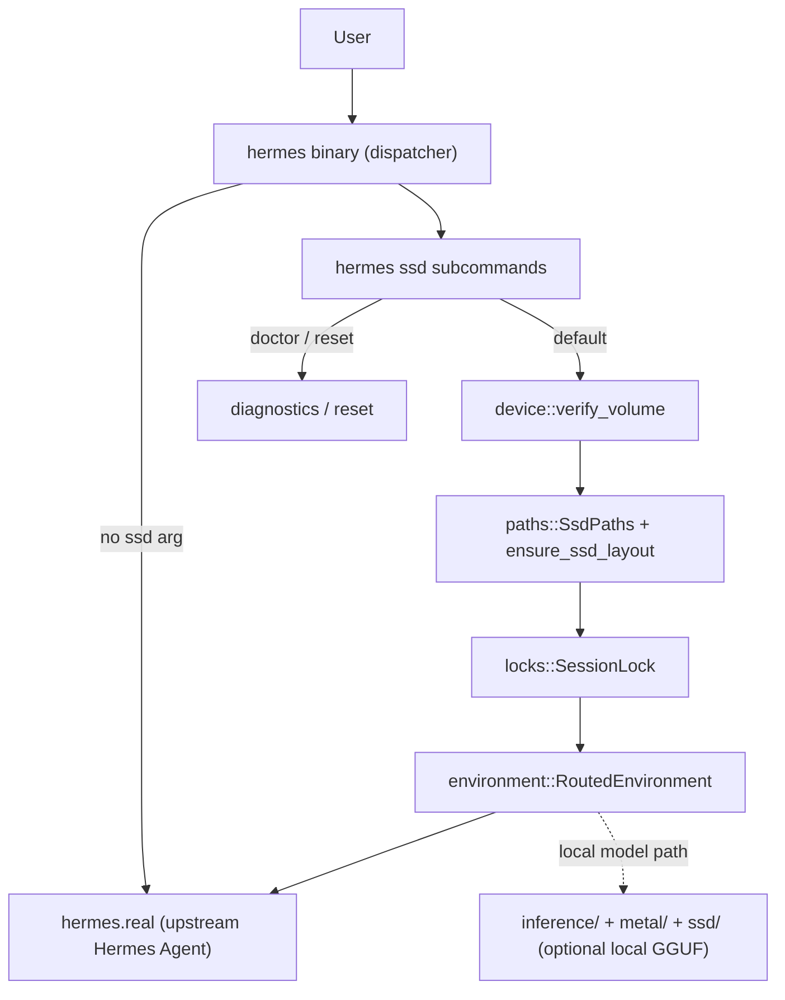

# Architecture — Hermes SSD LLM

Rust 2021 crate (`hermes-ssd-llm`) with two binaries and a preserved SSD-streaming inference engine.

## System diagram

## Modes

### Mode A — SSD-backed Hermes storage (always)

When `hermes ssd` succeeds validation, child processes receive redirected paths:

| Variable | SSD location |
|----------|----------------|
| `HERMES_HOME` | `<SSD>/Hermes-SSD-LLM/data/hermes` |
| `TMPDIR` | `<SSD>/Hermes-SSD-LLM/tmp` |
| `HF_HOME` | `<SSD>/Hermes-SSD-LLM/cache/huggingface` |
| `CARGO_TARGET_DIR` | `<SSD>/Hermes-SSD-LLM/cache/rust` |
| models | `<SSD>/Hermes-SSD-LLM/models/gguf` |
| logs | `<SSD>/Hermes-SSD-LLM/logs` |

Credentials remain in Keychain and normal secure macOS locations.

### Mode B — SSD-backed local inference (optional)

When a compatible GGUF model is configured and the local runtime is invoked (`hermes-ssd-llm` CLI or future Hermes integration):

- Layers are memory-mapped from SSD
- 1–2 active layers in unified memory
- Prefetch of next layer during GPU compute
- LRU cache for hot layers
- KV block swap to SSD under memory pressure
- Metal kernels for matmul, attention, RoPE, dequant

Unified memory is still required for active compute, Metal resources, and loaded layers.

### Mode C — Remote provider

Cursor, OpenAI, Anthropic, etc. run inference remotely. SSD mode still routes Hermes data, caches, sessions, and workspaces to the external drive.

## Command dispatch

`src/bin/hermes.rs`:

1. If first arg is `ssd` → `cli::handle_ssd_subcommand`
2. Else → resolve `hermes.real` and `exec` passthrough with original args

No recursive wrapper invocation. Install script places the Rust binary at `~/.local/bin/hermes` and preserves upstream at `~/.local/bin/hermes.real`.

## SSD identification

Registration stores `volume_uuid` in `~/.config/hermes-ssd-llm/config.toml`.

At launch, `device::verify_volume`:

1. Locates mount by UUID via `diskutil`
2. Confirms external, writable, supported filesystem
3. Checks free space thresholds
4. Refuses if identity mismatch or `allow_internal_fallback` is true

## Concurrency and drive removal

- `SessionLock` prevents overlapping SSD-mode sessions
- Unclean shutdown flagged in runtime state
- Failed I/O on SSD → fatal error, no internal fallback
- Cannot survive physical unplug mid-session

## Configuration

| File | Purpose |
|------|---------|
| `~/.config/hermes-ssd-llm/config.toml` | SSD registration, thresholds, Hermes path |
| `<SSD>/Hermes-SSD-LLM/config/runtime.toml` | Runtime tuning (optional) |

Schema version migrations in `config/migration.rs`.

## Testing strategy

| Layer | Location |
|-------|----------|
| Unit | `src/**/mod.rs` `#[cfg(test)]` |
| CLI routing | `tests/cli_routing.rs` |
| Integration | `tests/integration.rs`, `tests/integration_paths.rs` |
| Reset safety | `tests/reset_safety.rs` |
| Benchmarks | `benchmarks/scripts/*.sh` (measured, not estimated) |

## Module responsibilities

| Module | Responsibility |
|--------|----------------|
| `cli` | Subcommand routing, launch orchestration |
| `config` | Load/save/migrate TOML |
| `device` | Volume discovery and verification |
| `environment` | Build env map for child processes |
| `launcher` | Resolve and exec real Hermes |
| `locks` | PID lock, stale detection |
| `paths` | Directory layout constants and creation |
| `reset` | Scoped cleanup with path validation |
| `diagnostics` | Doctor report generation |
| `ssd` | mmap pool, prefetch, block swap, memory pressure |
| `model` | GGUF parsing and layer cache |
| `metal` | GPU compute shaders |
| `inference` | Transformer forward pass, KV cache, sampling |
| `api` | Ollama/OpenAI-compatible HTTP server |
