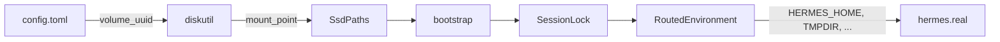
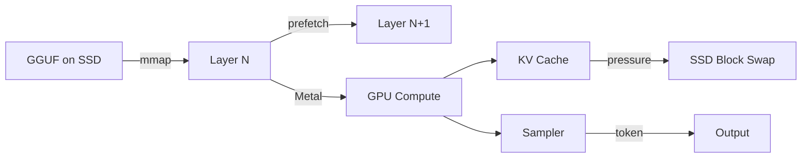

# ARCHITECTURE.md — Hermes SSD LLM

Living high-level architecture reference. Update this document when components, boundaries, or data flows change.

For plain-language overview: [README.md](README.md)  
For deep technical detail and ADRs: [TECHNICAL.md](TECHNICAL.md)

**Last reviewed:** 2026-07-30 · v0.3.1

---

## Purpose

Hermes SSD LLM is a macOS storage routing layer and optional local inference runtime for [Hermes Agent](https://hermes-agent.nousresearch.com/). It validates a registered external SSD, redirects data paths, and launches upstream Hermes unchanged.

---

## Component Map

```
┌─────────────────────────────────────────────────────────────────────────┐
│                           Hermes SSD LLM                                │
├─────────────────────────────────────────────────────────────────────────┤
│                                                                         │
│  ┌─────────────┐   ┌─────────────┐   ┌─────────────┐   ┌───────────┐ │
│  │   hermes    │   │    cli      │   │   device    │   │   paths   │ │
│  │ (dispatcher)│──▶│  (routing)  │──▶│ (discovery/ │──▶│ (layout)  │ │
│  │             │   │             │   │  verify)    │   │           │ │
│  └─────────────┘   └─────────────┘   └─────────────┘   └───────────┘ │
│         │                                    │                │       │
│         │              ┌─────────────┐       │                │       │
│         │              │  bootstrap  │◀──────┴────────────────┘       │
│         │              │ (seed home) │                                │
│         │              └─────────────┘                                 │
│         │                    │                                         │
│         │    ┌───────────────┼───────────────┐                        │
│         │    ▼               ▼               ▼                        │
│         │ ┌──────┐    ┌────────────┐   ┌──────────┐                  │
│         │ │locks │    │environment │   │ launcher │                  │
│         │ │(PID) │    │ (env vars) │   │ (exec)   │                  │
│         │ └──────┘    └────────────┘   └────┬─────┘                  │
│         │                                    │                        │
│         │                                    ▼                        │
│         │                           ┌─────────────┐                  │
│         │                           │ hermes.real │                  │
│         │                           │  (upstream) │                  │
│         │                           └─────────────┘                  │
│         │                                                             │
│  ┌──────┴──────────────────────────────────────────────────────┐     │
│  │              hermes-ssd-llm (inference CLI)                  │     │
│  │  ┌────────┐  ┌────────┐  ┌────────┐  ┌────────┐  ┌───────┐ │     │
│  │  │ model  │─▶│  ssd   │─▶│ metal  │─▶│inference│─▶│  api  │ │     │
│  │  │ (GGUF) │  │ (mmap) │  │ (GPU)  │  │(engine) │  │(HTTP) │ │     │
│  │  └────────┘  └────────┘  └────────┘  └────────┘  └───────┘ │     │
│  └───────────────────────────────────────────────────────────────┘     │
│                                                                         │
│  ┌─────────────┐   ┌─────────────┐   ┌─────────────┐                  │
│  │   config    │   │    reset    │   │ diagnostics │                  │
│  │ (TOML I/O)  │   │ (safe wipe) │   │  (doctor)   │                  │
│  └─────────────┘   └─────────────┘   └─────────────┘                  │
│                                                                         │
└─────────────────────────────────────────────────────────────────────────┘
```

---

## Components and Responsibilities

| Component | Module | Responsibility |
|-----------|--------|----------------|
| **Dispatcher** | `bin/hermes.rs` | Route `hermes` vs `hermes ssd`; no recursive wrapping |
| **CLI** | `cli/` | Subcommand handling: launch, doctor, reset, help |
| **Config** | `config/` | Load/save/validate/migrate `config.toml` |
| **Device** | `device/` | Discover volumes via `diskutil`; verify UUID, space, RW |
| **Paths** | `paths/` | SSD directory constants; `ensure_ssd_layout()` |
| **Bootstrap** | `bootstrap.rs` | Seed SSD `HERMES_HOME` from `~/.hermes` on first launch |
| **Environment** | `environment/` | Build `RoutedEnvironment` env var map |
| **Launcher** | `launcher/` | Resolve `hermes.real`; `exec()` with routed env |
| **Locks** | `locks/` | PID session lock; unclean shutdown detection |
| **Reset** | `reset/` | Scoped cleanup with path safety validation |
| **Diagnostics** | `diagnostics/` | Doctor report generation and printing |
| **Model** | `model/` | GGUF parsing, layer metadata, LRU cache |
| **SSD** | `ssd/` | mmap pool, prefetch, block swap, memory pressure |
| **Metal** | `metal/` | GPU compute kernels (matmul, attention, RoPE) |
| **Inference** | `inference/` | Transformer forward pass, KV cache, sampling |
| **API** | `api/` | OpenAI/Ollama-compatible HTTP server |
| **Errors** | `errors/` | Typed errors with exit codes |

---

## Operating Modes

### Mode A — SSD-backed storage (primary)

Triggered by: `hermes ssd`

All Hermes data, caches, temp files, and build artifacts route to the external SSD. Upstream Hermes runs unchanged.

### Mode B — Normal passthrough

Triggered by: `hermes` (no `ssd` argument)

No validation. No env mutation. Direct exec to `hermes.real`.

### Mode C — Local inference (optional)

Triggered by: `hermes-ssd-llm` CLI (bench, serve)

GGUF models streamed from SSD with Metal GPU acceleration. Not yet auto-launched by `hermes ssd`.

### Mode D — Remote provider

Hermes configured with Cursor, OpenAI, etc. SSD mode still routes local state; inference runs remotely.

---

## Data Flow

### Launch flow



### Inference flow



---

## Storage Boundaries

```
┌──────────────── MacBook (internal) ─────────────────┐
│  ~/.config/hermes-ssd-llm/config.toml  (0600)    │
│  ~/.local/bin/hermes          (Rust dispatcher)   │
│  ~/.local/bin/hermes.real     (upstream Hermes)   │
│  Keychain / credentials                           │
└───────────────────────────────────────────────────┘
                        │
                        │ USB
                        ▼
┌──────────────── External SSD ─────────────────────┐
│  /Volumes/<name>/Hermes-SSD-LLM/                  │
│    data/hermes/     ← HERMES_HOME                 │
│    models/gguf/     ← AI models                   │
│    cache/           ← HF, Rust, Hermes caches     │
│    tmp/             ← TMPDIR                      │
│    logs/            ← Application logs            │
│    runtime/         ← Locks, sessions, state      │
│    repositories/    ← Git clones                  │
│    workspaces/      ← Active projects             │
└───────────────────────────────────────────────────┘
```

---

## Key Invariants

1. `allow_internal_fallback` is always `false` and rejected if set `true`
2. SSD validation runs before every `hermes ssd` launch
3. Reset only operates on paths under `<SSD>/Hermes-SSD-LLM/`
4. Credentials never redirect to SSD
5. One active SSD session per volume (PID lock)
6. `hermes` passthrough never modifies environment

---

## External Dependencies

| Dependency | Role |
|------------|------|
| Hermes Agent | Upstream AI assistant (Python) |
| macOS `diskutil` | Volume discovery |
| macOS `df` | Free space check |
| Metal framework | GPU inference (Apple Silicon) |
| Rust toolchain | Build and runtime |

---

## Test Coverage Map

| Area | Test Location |
|------|---------------|
| Config validation | `config/hermes_ssd_llm_config.rs` |
| Path layout | `paths/mod.rs`, `tests/integration_paths.rs` |
| Env routing | `environment/mod.rs` |
| Lock stale detection | `locks/mod.rs` |
| Reset path safety | `reset/mod.rs`, `tests/reset_safety.rs` |
| CLI dispatch | `tests/cli_routing.rs` |
| Bootstrap | `bootstrap.rs` |

---

## Change Log

| Date | Change |
|------|--------|
| 2026-07-30 | Added `bootstrap.rs` for SSD home seeding |
| 2026-07-30 | Documentation rewrite (README, TECHNICAL, ARCHITECTURE, CONTRIBUTING) |
| 2026-07-30 | Benchmarks refreshed on MacBook Air M2 + SanDisk Extreme 2TB |

---

## When to Update This Document

Update ARCHITECTURE.md when you:

- Add or remove a module
- Change data flow or storage boundaries
- Add a new operating mode
- Change external dependencies
- Modify the SSD directory layout
- Change validation or lock behavior

Do **not** duplicate ADR rationale here — link to [TECHNICAL.md](TECHNICAL.md#architecture-decision-records).
