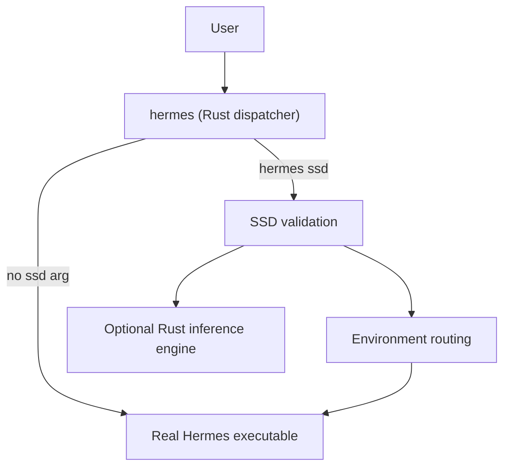

# Hermes SSD LLM

**A Rust 2021 project** that extends [Hermes Agent](https://hermes-agent.nousresearch.com/) with SSD-backed storage and optional local GGUF inference on Apple Silicon.

| Component | Type | Purpose |
|-----------|------|---------|
| `hermes` | Rust binary | Command dispatcher — normal Hermes or SSD mode |
| `hermes-ssd-llm` | Rust binary | Doctor, SSD registration, GGUF utilities |
| `hermes_ssd_llm` | Rust library crate | Volume validation, env routing, locks, inference engine |

Uses **Metal** on macOS for GPU kernels. Built with `cargo build --release`.

## Two-step workflow

1. Connect your registered external SSD.
2. Run:

```bash
hermes ssd
```

That validates the drive, routes heavy data to the SSD, and launches the **same** Hermes TUI as plain `hermes`.

Normal Hermes is unchanged:

```bash
hermes
```

## What SSD mode does

### Storage routing (always on successful launch)

Routes eligible data to `<SSD>/Hermes-SSD-LLM/`:

- Hermes data (`HERMES_HOME`)
- Model downloads and GGUF files
- Caches (Hugging Face, transformers, Rust build, inference)
- Temp files, sessions, logs, workspaces

Credentials stay in normal macOS secure locations. **SSD mode never silently falls back to the internal Mac drive.**

### Local inference (optional)

The Rust inference engine streams transformer layers from SSD:

- Memory-mapped GGUF loading
- Layer prefetch and LRU cache
- KV-cache block swapping
- Metal GPU kernels (matmul, softmax, RoPE, dequant)

Active tensors, Metal resources, Hermes, and the OS still use unified memory. SSD mode reduces internal-drive pressure and enables models larger than RAM — it does not eliminate RAM use.

### Remote providers

With Cursor, OpenAI, Anthropic, etc., inference runs remotely. SSD mode still routes local Hermes state and caches to the external drive.

## Architecture



## Requirements

- **macOS** (Apple Silicon recommended)
- **Rust** toolchain (`rustup`, edition 2021)
- **Hermes Agent** already installed
- External SSD registered via `install.sh`

## Installation

```bash
git clone https://github.com/maxiguillermo1/hermes-ssd-llm.git
cd hermes-ssd-llm
./install.sh
hermes ssd doctor
```

`install.sh` builds release Rust binaries, backs up the real Hermes binary to `~/.local/bin/hermes.real`, installs the dispatcher as `hermes`, registers your SSD, and writes `~/.config/hermes-ssd-llm/config.toml`.

Uninstall (restores original `hermes`, keeps SSD data):

```bash
./uninstall.sh
```

## Configuration

`~/.config/hermes-ssd-llm/config.toml`:

```toml
version = 1
volume_uuid = "YOUR-VOLUME-UUID"
expected_volume_name = "Extreme SSD"
minimum_capacity_gb = 1800
minimum_free_space_gb = 100
minimum_write_space_gb = 20
require_external_device = true
allow_internal_fallback = false
```

SSD directory root: `<mount>/Hermes-SSD-LLM/` (models, cache, runtime, logs, workspaces).

## Commands

| Command | Description |
|---------|-------------|
| `hermes` | Normal Hermes (unchanged) |
| `hermes ssd` | SSD-backed Hermes |
| `hermes ssd doctor` | Diagnostics |
| `hermes ssd doctor --throughput` | Diagnostics + I/O probe |
| `hermes-ssd-llm register <mount>` | Register SSD (install helper) |

## Rust development

```bash
cargo fmt --check
cargo clippy --all-targets --all-features -- -D warnings
cargo test --lib --tests
cargo build --release
```

Project layout:

```text
src/
  bin/hermes.rs           # Hermes command dispatcher
  bin/hermes_ssd_llm.rs   # Doctor, register, inference CLI
  cli/                    # Argument parsing
  config/                 # TOML config + migrations
  device/                 # SSD volume discovery (diskutil)
  diagnostics/            # Doctor command
  environment/            # Path routing for SSD mode
  launcher/               # exec real Hermes
  locks/                  # Session locks
  ssd/                    # mmap, prefetch, block swap
  metal/                  # Metal GPU kernels
  inference/              # Transformer forward pass
  model/                  # GGUF loading
  api/                    # OpenAI/Ollama-compatible server
```

## License

MIT License — Copyright (c) 2026 Maxi Guillermo. See `LICENSE`.
