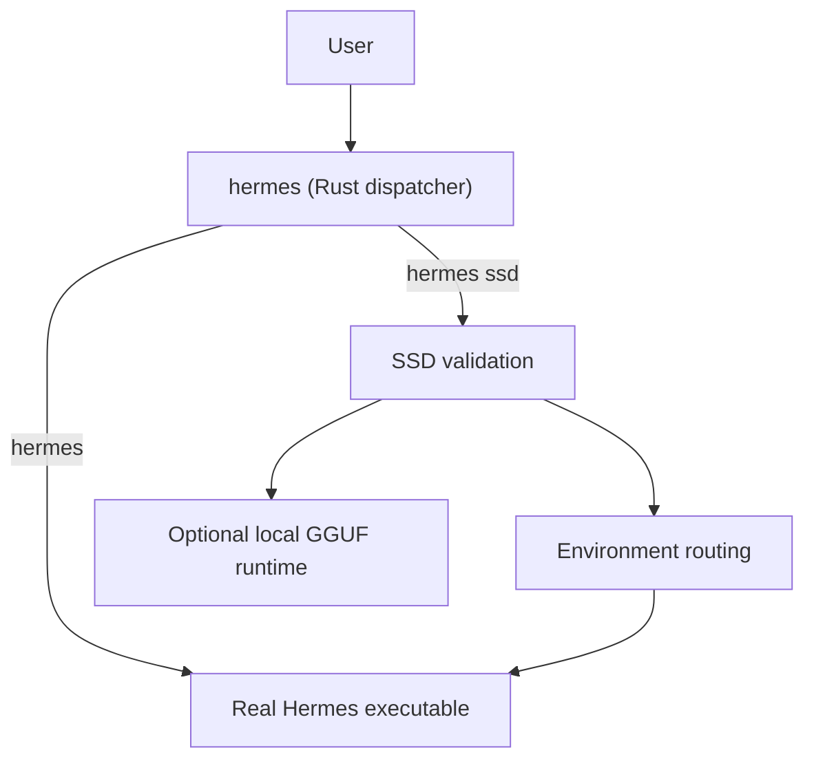

# Hermes SSD LLM

**Rust 2021** project — SSD-backed storage routing and optional local GGUF inference for [Hermes Agent](https://hermes-agent.nousresearch.com/) on Apple Silicon.

| Binary | Role |
|--------|------|
| `hermes` | Dispatcher: normal Hermes or `hermes ssd` |
| `hermes-ssd-llm` | Doctor, SSD registration, GGUF utilities |

## Status

v0.3.0 — production launcher with safe reset, hardware-aware benchmarks, and SSD-streaming inference engine.

## Two-action workflow

```text
1. Connect the registered 2TB SanDisk Portable SSD.
2. Run: hermes ssd
```

Use Hermes normally. The TUI, providers, skills, and tools are unchanged.

Normal mode (internal paths):

```bash
hermes
```

SSD-backed mode (verified external drive, no internal fallback):

```bash
hermes ssd
```

## What SSD mode changes

- Routes `HERMES_HOME`, caches, models, temp files, logs, sessions, and build artifacts to `<SSD>/Hermes-SSD-LLM/`
- Validates the registered SSD on every launch (UUID, external, writable, free space)
- Refuses to continue if the SSD is missing, wrong, read-only, or full

## What SSD mode does not change

- Hermes TUI, keyboard shortcuts, provider selection, skills, or tools
- Credentials (stay in Keychain / normal secure locations)
- Remote inference (Cursor, OpenAI, etc. still run remotely)

## Memory and storage (honest)

- Active computation, Metal, Hermes, OS, and loaded model layers still use **unified memory**
- SSD mode reduces **internal-drive** use and memory **pressure** for large local models
- A model that fits entirely in RAM may be faster than SSD streaming
- Remote providers do not run model weights on your SSD — only local state is SSD-backed

## Tested hardware (detected system — 2026-07-30)

| Field | Value |
|-------|-------|
| Mac model | MacBook Air (Mac14,2) |
| Chip | Apple M2 |
| Unified memory | 8.0 GiB |
| Internal storage available | 16.0 GiB of 228.3 GiB |
| macOS | 26.2 |
| External SSD manufacturer | SanDisk |
| External SSD model (macOS report) | Extreme SSD (volume name) |
| SSD capacity | 1863 GB formatted |
| SSD available | 1834 GB |
| SSD filesystem | ExFAT |
| SSD connection | USB |
| Hermes version | v0.19.0 |
| Hermes SSD LLM | 0.3.0 |
| Rust | 1.97.1 |

> These results apply to the detected test Mac only. Re-run `./scripts/capture-test-system.sh` on your machine.

## Installation

```bash
git clone https://github.com/maxiguillermo1/hermes-ssd-llm.git
cd hermes-ssd-llm
./install.sh
hermes ssd doctor
```

## First launch

```bash
hermes ssd
```

Creates required directories on the SSD automatically.

## Reset to first-run state

Preview:

```bash
hermes ssd reset --dry-run
```

Clean runtime state (preserves models and config):

```bash
hermes ssd reset
```

Also remove models:

```bash
hermes ssd reset --include-models
```

Full project-managed data reset:

```bash
hermes ssd reset --all-managed-data
```

## Doctor

```bash
hermes ssd doctor
hermes ssd doctor --throughput
```

## SSD directory layout

```text
<SSD>/Hermes-SSD-LLM/
├── models/gguf/
├── cache/
├── data/hermes/      ← HERMES_HOME
├── tmp/              ← TMPDIR
├── logs/
├── runtime/
├── repositories/
└── workspaces/
```

## Local-model behavior

When a GGUF model is configured and the local runtime is used, the Rust engine streams layers from SSD with prefetch and LRU caching. See `hermes-ssd-llm bench` and `BENCHMARKS.md`.

## Remote-provider behavior

SSD mode still routes Hermes data and caches to the SSD. Model inference runs on the remote provider.

## Benchmarks

```bash
./benchmarks/scripts/generate-report.sh
```

See `BENCHMARKS.md` for measured results on the test system.

## Architecture



## Configuration

`~/.config/hermes-ssd-llm/config.toml` — volume UUID, thresholds, Hermes executable path.

## Safety

- No silent fallback to internal storage when SSD mode is requested
- Reset refuses paths outside managed SSD directories
- Doctor redacts secrets from output

## Development (Rust)

```bash
cargo fmt --check
cargo clippy --all-targets --all-features -- -D warnings
cargo test --lib --tests
cargo build --release
```

```text
src/
  bin/hermes.rs           # Dispatcher
  bin/hermes_ssd_llm.rs   # Doctor, register, inference CLI
  reset/                  # Safe first-run reset
  device/                 # Volume discovery
  environment/            # Path routing
  ssd/, metal/, inference/  # Local inference engine
```

## Known limitations

- Cannot survive SSD unplug mid-session (fails closed)
- ExFAT lacks some macOS-native features vs APFS
- 8 GB unified memory limits local model size even with SSD streaming
- Doctests in inference modules may fail (cosmetic)

## License

MIT — Copyright (c) 2026 Maxi Guillermo. See `LICENSE`.

## Upstream

Local inference engine derived from the open-source [ssd-llm](https://github.com/redbasecap-buiss/ssd-llm) project. See `NOTICE` if present.
