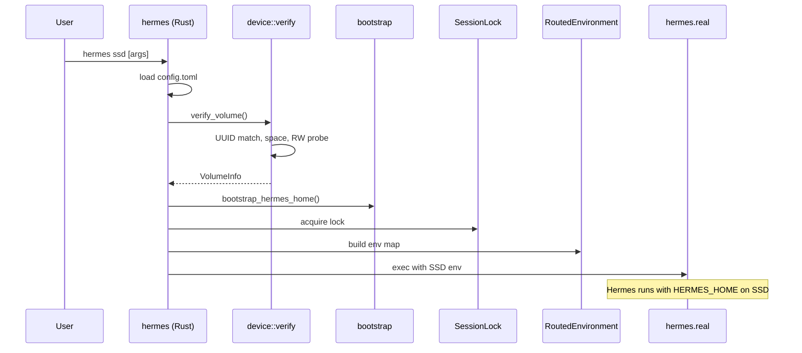

# TECHNICAL.md — Hermes SSD LLM

This document is the authoritative technical reference for senior software engineers working on or integrating with Hermes SSD LLM. For a plain-language overview, see [README.md](README.md). For a living component map, see [ARCHITECTURE.md](ARCHITECTURE.md).

**Version:** 0.3.5  
**Edition:** 2021 (Rust)  
**Platform:** macOS (Apple Silicon primary target)

### Scope

| Layer | Status |
|-------|--------|
| **Primary product** | `hermes ssd` — SSD validation, env routing, bootstrap, launch `hermes.real` |
| **Admin CLI** | `hermes ssd doctor/reset`, `hermes-ssd-llm doctor/register/info/models` |
| **Advanced (in repo)** | Local GGUF inference engine (`inference/`, `metal/`, `api/`) — library code, not wired to daily launch. See [ADVANCED.md](ADVANCED.md) and [ROADMAP.md](ROADMAP.md). |

Sections on model management, memory management, and inference flows below describe the **advanced engine**, not what runs when you type `hermes ssd` with a cloud provider.

---

## Table of Contents

1. [System Architecture](#system-architecture)
2. [Repository Structure](#repository-structure)
3. [Directory Layout](#directory-layout)
4. [Boot Sequence](#boot-sequence)
5. [Initialization Lifecycle](#initialization-lifecycle)
6. [Storage Layout](#storage-layout)
7. [File Ownership](#file-ownership)
8. [Configuration System](#configuration-system)
9. [Health Checking Pipeline](#health-checking-pipeline)
10. [Launcher Architecture](#launcher-architecture)
11. [Dependency Management](#dependency-management)
12. [Logging Architecture](#logging-architecture)
13. [Caching Architecture](#caching-architecture)
14. [Model Management](#model-management)
15. [Memory Management](#memory-management)
16. [Temporary Workspace](#temporary-workspace)
17. [Backup Strategy](#backup-strategy)
18. [Recovery Strategy](#recovery-strategy)
19. [Error Handling](#error-handling)
20. [Retry Behavior](#retry-behavior)
21. [Validation Pipeline](#validation-pipeline)
22. [CLI Architecture](#cli-architecture)
23. [State Machine](#state-machine)
24. [Data Flow](#data-flow)
25. [Boot Timeline](#boot-timeline)
26. [Performance Considerations](#performance-considerations)
27. [Apple Silicon Optimizations](#apple-silicon-optimizations)
28. [SSD I/O Considerations](#ssd-io-considerations)
29. [USB Throughput Assumptions](#usb-throughput-assumptions)
30. [Future Scaling Strategy](#future-scaling-strategy)
31. [Testing Strategy](#testing-strategy)
32. [Benchmark Methodology](#benchmark-methodology)
33. [Security Considerations](#security-considerations)
34. [Threat Model](#threat-model)
35. [Design Tradeoffs](#design-tradeoffs)
36. [Alternative Architectures Considered](#alternative-architectures-considered)
37. [Known Limitations](#known-limitations)
38. [Future Improvements](#future-improvements)
39. [Engineering Philosophy](#engineering-philosophy)
40. [Architecture Decision Records](#architecture-decision-records)

---

## System Architecture

Hermes SSD LLM is a Rust crate (`hermes-ssd-llm`) that provides:

1. **Storage routing layer** — validates an external SSD and redirects Hermes Agent data paths *(shipped)*
2. **Launcher wrapper** — dispatches `hermes` vs `hermes ssd` without modifying upstream Hermes *(shipped)*
3. **Local inference engine** — optional GGUF streaming runtime with Metal GPU acceleration *(library in repo; CLI `bench`/`serve` not exposed yet)*

```
┌─────────────────────────────────────────────────────────────────┐
│                         User (Terminal)                         │
└────────────────────────────┬────────────────────────────────────┘
                             │
                    ┌────────▼────────┐
                    │  hermes (bin)   │  Dispatcher binary
                    └────────┬────────┘
              ┌──────────────┼──────────────┐
              │              │              │
         no "ssd"       "ssd" subcmd    "ssd" default
              │              │              │
              ▼              ▼              ▼
     ┌────────────┐  ┌────────────┐  ┌─────────────────────────┐
     │ hermes.real│  │ doctor/    │  │ verify → bootstrap →    │
     │ (passthrough)│ │ reset      │  │ lock → env → exec       │
     └────────────┘  └────────────┘  └───────────┬─────────────┘
                                                  │
                                         ┌────────▼────────┐
                                         │   hermes.real   │
                                         │ (Hermes Agent)  │
                                         └─────────────────┘

Optional parallel path (advanced — not auto-started by `hermes ssd`):
┌──────────────────┐    ┌─────────┐    ┌────────┐    ┌──────────┐
│ hermes-ssd-llm   │───▶│ model/  │───▶│ ssd/   │───▶│ metal/   │
│ (inference CLI)  │    │ (GGUF)  │    │ mmap   │    │ GPU ops  │
└──────────────────┘    └─────────┘    └────────┘    └──────────┘
```

### Design Principles

- **Fail closed** — SSD mode never silently falls back to internal storage
- **Thin wrapper** — upstream Hermes is exec'd, not reimplemented
- **Process-scoped routing** — environment variables redirect paths for the child process tree only
- **Measured claims** — benchmarks document real numbers, not estimates

---

## Repository Structure

```
hermes-ssd-llm/
├── src/
│   ├── bin/
│   │   ├── hermes.rs              # Dispatcher entry point
│   │   └── hermes_ssd_llm.rs      # Inference/doctor/register CLI
│   ├── api/                       # OpenAI/Ollama-compatible HTTP server
│   ├── benchmark.rs               # Inference benchmark harness
│   ├── bootstrap.rs               # Seed SSD HERMES_HOME from ~/.hermes
│   ├── cli/                       # SSD subcommand routing
│   ├── config/                    # TOML load/save/migrate
│   ├── device/                    # Volume discovery and verification
│   ├── diagnostics/               # Doctor report generation
│   ├── environment/               # RoutedEnvironment builder
│   ├── errors/                    # Typed errors and exit codes
│   ├── inference/                 # Transformer engine (30+ modules)
│   ├── launcher/                  # Resolve and exec hermes.real
│   ├── locks/                     # Session PID lock
│   ├── metal/                     # Metal compute shaders
│   ├── model/                     # GGUF parser and layer cache
│   ├── paths/                     # SSD directory layout
│   ├── pull/                      # Model download utilities
│   ├── reset/                     # Safe scoped cleanup
│   ├── runtime/                   # Runtime state helpers
│   └── ssd/                       # mmap pool, prefetch, block swap
├── tests/                         # Integration and safety tests
├── benches/                       # Criterion inference benchmarks
├── benchmarks/                    # Shell-based system benchmarks
│   ├── scripts/
│   └── results/
├── install.sh                     # Idempotent user-local installer
├── Cargo.toml
└── docs/                          # README, TECHNICAL, ARCHITECTURE, etc.
```

### Binaries

| Binary | Path | Role |
|--------|------|------|
| `hermes` | `src/bin/hermes.rs` | Dispatcher: passthrough or `ssd` subcommand |
| `hermes-ssd-llm` | `src/bin/hermes_ssd_llm.rs` | Doctor, register, launch, info, models |

Install script places both in `~/.local/bin/` and preserves upstream Hermes at `~/.local/bin/hermes.real`.

---

## Directory Layout

### On the external SSD

Root: `<mount>/Hermes-SSD-LLM/` (legacy alias: `<mount>/Hermes-SSD/`)

```
Hermes-SSD-LLM/
├── bin/                    # Optional user scripts
├── config/
│   └── runtime.toml        # Runtime tuning (optional)
├── data/
│   └── hermes/             # HERMES_HOME — profiles, skills, sessions, memories
├── models/
│   ├── gguf/               # Primary GGUF model storage
│   ├── draft/              # Speculative decoding draft models
│   ├── vision/             # Vision model weights
│   ├── adapters/           # LoRA adapters
│   └── downloads/          # In-progress downloads
├── cache/
│   ├── hermes/             # Hermes-specific caches
│   ├── huggingface/        # HF_HOME / hub cache
│   ├── transformers/       # TRANSFORMERS_CACHE
│   ├── rust/               # CARGO_TARGET_DIR
│   ├── build/              # Build artifact cache
│   └── inference/          # Inference runtime cache
├── runtime/
│   ├── locks/              # Session lock, probe files
│   ├── sessions/           # Active session metadata
│   ├── sockets/            # IPC sockets
│   └── state/              # Unclean shutdown flags, XDG state
├── tmp/                    # TMPDIR
├── logs/                   # HERMES_SSD_LLM_LOG_DIR
├── benchmarks/             # Local benchmark output
├── repositories/           # Git clones
├── workspaces/             # Active project workspaces
└── backups/                # User backups
```

### On the host Mac (not on SSD)

```
~/.config/hermes-ssd-llm/
└── config.toml             # Volume UUID, thresholds, Hermes path (mode 0600)

~/.local/bin/
├── hermes                  # Rust dispatcher (replaces PATH entry)
├── hermes.real             # Upstream Hermes Agent
└── hermes-ssd-llm          # Inference CLI

~/.hermes/                  # Default Hermes home (bootstrap source only)
```

---

## Boot Sequence

### `hermes` (normal mode)

```
main() → args[0] != "ssd"
       → HermesSsdLlmConfig::load_or_default()
       → resolve_real_hermes()
       → exec_hermes_passthrough(real, args)
```

No SSD validation. No environment mutation.

### `hermes ssd` (SSD mode)

```
main() → args[0] == "ssd"
       → handle_ssd_subcommand(rest)
       → launch_ssd_mode(args)
           1. migrate_config_if_needed()
           2. HermesSsdLlmConfig::load()
           3. Reject if allow_internal_fallback == true
           4. verify_volume(cfg)
              a. discover_volume_by_uuid()
              b. Check external, writable, filesystem, capacity, free space
              c. ensure_ssd_layout()
              d. probe_read_write()
           5. SsdPaths::from_mount()
           6. bootstrap_hermes_home() — seed config.yaml, .env, ENGINEERING-CONSTITUTION.md
           7. SessionLock::clear_unclean()
           8. SessionLock::acquire() — PID lock at runtime/locks/
           9. RoutedEnvironment::build() — set env vars
          10. resolve_real_hermes()
          11. exec_hermes(real, args, env) — replaces current process
```

### Sequence diagram



---

## Initialization Lifecycle

| Phase | Component | Action |
|-------|-----------|--------|
| Install | `install.sh` | Build release, backup real Hermes, register SSD UUID |
| First `hermes ssd` | `paths::ensure_ssd_layout` | Create all subdirectories with mode 0750 |
| First `hermes ssd` | `bootstrap::bootstrap_hermes_home` | Copy missing config from `~/.hermes` |
| Every launch | `device::verify_volume` | Full validation pipeline |
| Every launch | `locks::SessionLock` | Acquire PID lock, detect stale locks |
| Shutdown | `SessionLock::Drop` | Release lock file |
| Unclean exit | `runtime/state/unclean_shutdown` | Flag set if lock not released cleanly |

---

## Storage Layout

### Environment variable routing

| Variable | SSD Path | Purpose |
|----------|----------|---------|
| `HERMES_HOME` | `data/hermes` | All Hermes profile data |
| `TMPDIR` | `tmp` | Temporary files |
| `XDG_CACHE_HOME` | `cache/hermes/xdg-cache` | XDG cache |
| `XDG_DATA_HOME` | `data/hermes/xdg-data` | XDG data |
| `XDG_STATE_HOME` | `runtime/state/xdg-state` | XDG state |
| `HF_HOME` | `cache/huggingface` | HuggingFace downloads |
| `HUGGINGFACE_HUB_CACHE` | `cache/huggingface/hub` | Hub cache |
| `TRANSFORMERS_CACHE` | `cache/transformers` | Transformers cache |
| `CARGO_TARGET_DIR` | `cache/rust/target` | Rust build artifacts |
| `HERMES_SSD_LLM_MODELS` | `models/gguf` | GGUF model path |
| `HERMES_SSD_LLM_LOG_DIR` | `logs` | Application logs |
| `HERMES_SSD_LLM_MODE` | `1` | Flag indicating SSD mode active |
| `HERMES_SSD_LLM_MOUNT` | mount point | Active volume path |
| `HERMES_SSD_LLM_ROOT` | root path | Hermes-SSD-LLM root |

`HERMES_HOME` redirect places Hermes config and secrets (`.env`, `auth.json`) on the SSD unless you symlink them from the Mac. This project does not implement Keychain-only credential storage by default.

---

## File Ownership

| Location | Owner | Writable by |
|----------|-------|-------------|
| `~/.config/hermes-ssd-llm/config.toml` | User | User only (0600) |
| SSD directories | User | User only (0750) |
| Session lock | Launching process | Released on drop |
| Reset targets | User | Validated against managed root |

Reset operations call `validate_managed_path()` to ensure:
- Path is under `<SSD>/Hermes-SSD-LLM/`
- No symlink escape
- Reject `/`, `$HOME`, `/Volumes` root, empty paths

---

## Configuration System

### Host config: `~/.config/hermes-ssd-llm/config.toml`

```toml
version = 1
volume_uuid = "XXXXXXXX-XXXX-XXXX-XXXX-XXXXXXXXXXXX"
expected_volume_name = "Extreme SSD"
minimum_capacity_gb = 1800
minimum_free_space_gb = 100
minimum_write_space_gb = 20
require_external_device = true
allow_internal_fallback = false   # Must remain false; enforced at load
layer_prefetch_depth = 2
max_ram_target_gb = 8
ssd_kv_swap = true
debug_startup = false
```

### Runtime config: `<SSD>/Hermes-SSD-LLM/config/runtime.toml`

Optional tuning for inference prefetch, RAM targets, and logging.

### Migration

`config/migration.rs` handles schema version upgrades. Config backups written to `config.toml.bak` on save.

---

## Health Checking Pipeline

`device::verify_volume()` executes in order:

1. **Discovery** — `diskutil` lookup by `volume_uuid`
2. **Presence** — error if volume not mounted (`SsdMissing`)
3. **External check** — reject internal volumes if `require_external_device`
4. **UUID match** — case-insensitive comparison
5. **Name match** — if `expected_volume_name` set
6. **Capacity** — total ≥ `minimum_capacity_gb` (default 1800)
7. **Free space** — available ≥ `minimum_free_space_gb` (default 100)
8. **Writable** — `VolumeInfo.writable` flag
9. **Filesystem** — APFS, ExFAT, FAT32, HFS+
10. **Layout** — `ensure_ssd_layout()` creates missing dirs
11. **RW probe** — write/read/delete test file in `runtime/locks/`
12. **Write headroom** — free ≥ `minimum_write_space_gb` (default 20)

`hermes ssd doctor` runs this pipeline plus routing report. `--throughput` adds a small I/O probe.

---

## Launcher Architecture

### Dispatcher (`src/bin/hermes.rs`)

- First arg `ssd` → `cli::handle_ssd_subcommand`
- Otherwise → `exec_hermes_passthrough` to `hermes.real`
- No recursive wrapper invocation

### Hermes resolution (`launcher/mod.rs`)

Search order:
1. `config.hermes_executable` if set
2. `~/.local/bin/hermes.real`
3. Common install paths

### Process replacement

`exec_hermes()` calls `std::process::Command::env_clear()` then sets routed vars, then `exec()`. The Rust process is replaced entirely — no parent wrapper remains.

---

## Dependency Management

### Rust dependencies (Cargo.toml)

| Crate | Purpose |
|-------|---------|
| `clap` | CLI parsing |
| `tokio` | Async runtime (API server) |
| `serde`/`toml` | Config serialization |
| `memmap2` | Memory-mapped model layers |
| `metal` | Apple GPU compute (macOS only) |
| `tracing` | Structured logging |
| `anyhow`/`thiserror` | Error handling |

Release profile: `opt-level = 3`, `lto = true`, `codegen-units = 1`.

### External dependencies

- macOS `diskutil` for volume discovery
- `df` for free space checks
- Upstream Hermes Agent (Python, installed separately)

---

## Logging Architecture

- Launcher messages to stderr prefixed with `Hermes SSD LLM:`
- `HERMES_SSD_LLM_LOG_DIR` routes application logs to SSD
- `logging_level` in config (default `info`)
- `debug_startup` enables env var dump (redacted in doctor)
- Doctor redacts vars matching `TOKEN`, `SECRET`, `PASSWORD`, `API_KEY`

---

## Caching Architecture

### Launcher caches (on SSD)

- HuggingFace hub cache
- Transformers cache
- Rust `target/` directory
- Hermes XDG cache

### Inference caches (in-process)

- `model/cache.rs` — LRU layer cache for hot GGUF layers
- `inference/prompt_cache.rs` — Prefix KV cache
- `inference/kv_cache.rs` / `mmap_kv_cache.rs` — Token KV storage
- `ssd/prefetch.rs` — Background prefetch of next layer

---

## Model Management

- Storage: `models/gguf/` (configurable via `HERMES_SSD_LLM_MODELS`)
- Format: GGUF (GPT-Generated Unified Format)
- Parser: `model/gguf.rs`
- Loader: `model/loader.rs` with memory-mapped layer access
- Download: `pull/` module for fetching models
- CLI: `hermes-ssd-llm info` / `models` shipped; `bench` planned (see [ROADMAP.md](ROADMAP.md))

---

## Memory Management

### Launcher

Minimal footprint (~51 MiB RSS measured). No model weights loaded.

### Inference engine

- **Unified memory budget** — `max_ram_target_gb` (default 8)
- **Layer streaming** — 1–2 active layers in RAM, rest on SSD via mmap
- **Prefetch** — `layer_prefetch_depth` (default 2) layers ahead
- **LRU eviction** — `model/cache.rs`
- **KV swap** — `ssd/block_swap.rs` spills KV blocks to SSD under pressure
- **Memory pressure** — `ssd/memory_pressure.rs` monitors and triggers eviction

Apple Silicon unified memory means CPU and GPU share the same physical RAM. Active Metal buffers and loaded layers both count against the 8 GB budget.

---

## Temporary Workspace

- `TMPDIR` → `<SSD>/Hermes-SSD-LLM/tmp/`
- Probe files in `runtime/locks/` deleted immediately after validation
- Reset cleans `tmp/`, `runtime/sessions/`, `runtime/sockets/`, `runtime/state/`

---

## Backup Strategy

- `backups/` directory on SSD for user-managed backups
- Reset writes a manifest before destructive operations
- Config backup: `config.toml.bak` on every save
- No automatic cloud backup (user responsibility)
- Recommendation: Time Machine exclude internal AI caches; include SSD volume

---

## Recovery Strategy

| Scenario | Recovery |
|----------|----------|
| Stale session lock | Auto-removed if PID dead |
| Unclean shutdown | Flag in `runtime/state/unclean_shutdown`; cleared on next launch |
| Corrupted cache | `hermes ssd reset` cleans runtime caches |
| Wrong SSD | Refused at verify; plug in correct drive |
| Missing config | Re-run `./install.sh` |
| Full SSD | Refused at verify; free space or reset |

---

## Error Handling

Typed errors in `errors/mod.rs`:

| Error | Exit Code | Meaning |
|-------|-----------|---------|
| `SsdMissing` | 2 | Registered volume not mounted |
| `IdentityMismatch` | 3 | Wrong UUID or volume name |
| `InsufficientSpace` | 4 | Below free space threshold |
| `ReadOnlyVolume` | 5 | Cannot write to SSD |
| `LockConflict` | 6 | Another SSD session active |
| `FallbackRefused` | 7 | Internal fallback attempted |
| `HermesMissing` | 8 | Upstream Hermes not found |
| `InvalidConfig` | 9 | Bad or missing config.toml |

All errors implement `exit_code()` for consistent CLI behavior.

---

## Retry Behavior

- No automatic retry on SSD validation failure (fail fast)
- Stale lock: single attempt to remove if PID dead, then acquire
- Config save: backup previous version before overwrite
- Inference prefetch: background retry on I/O error (logged, non-fatal)

---

## Validation Pipeline

See [Health Checking Pipeline](#health-checking-pipeline). Reset adds:

- `validate_managed_path()` — path containment
- Symlink resolution check
- Dry-run mode for preview without mutation

---

## CLI Architecture

### Shipped commands

```
hermes                          → passthrough to hermes.real
hermes ssd                      → launch SSD mode
hermes ssd doctor               → health report
hermes ssd doctor --throughput  → health + I/O probe
hermes ssd reset                → clean runtime state
hermes ssd reset --dry-run      → preview reset
hermes ssd reset --include-models
hermes ssd reset --all-managed-data
hermes ssd help

hermes-ssd-llm doctor           → standalone doctor
hermes-ssd-llm register <mount> → register SSD volume
hermes-ssd-llm launch [args]    → launch Hermes with SSD env (tests/install)
hermes-ssd-llm info <model>     → GGUF metadata
hermes-ssd-llm models [--dir]   → list GGUF files
```

### Planned (roadmap — not in binary yet)

```
hermes-ssd-llm bench <model>    → inference benchmark
hermes-ssd-llm serve            → OpenAI-compatible API server
```

Until these ship, use `cargo bench --bench inference_bench` for micro-benchmarks or `llama.cpp` for real local inference. See [ADVANCED.md](ADVANCED.md).

---

## State Machine

```
                    ┌──────────┐
                    │  IDLE    │
                    └────┬─────┘
                         │ hermes ssd
                         ▼
                    ┌──────────┐
              ┌────│ VALIDATE │────┐
              │fail└────┬─────┘    │pass
              ▼          │         ▼
         ┌────────┐     │    ┌──────────┐
         │ ERROR  │     │    │ BOOTSTRAP│
         └────────┘     │    └────┬─────┘
                         │         │
                         │         ▼
                         │    ┌──────────┐
                         │    │  LOCK    │───conflict──▶ ERROR
                         │    └────┬─────┘
                         │         │
                         │         ▼
                         │    ┌──────────┐
                         │    │   EXEC   │
                         │    └────┬─────┘
                         │         │
                         │         ▼
                         │    ┌──────────┐
                         │    │ RUNNING  │ (hermes.real)
                         │    └────┬─────┘
                         │         │ exit
                         │         ▼
                         │    ┌──────────┐
                         └────│ RELEASE  │
                              └──────────┘
```

---

## Data Flow

### Storage routing flow

```
config.toml (UUID)
    → diskutil (mount point)
    → SsdPaths (directory map)
    → RoutedEnvironment (env vars)
    → exec(hermes.real) with env
    → Hermes reads HERMES_HOME, TMPDIR, caches from SSD
```

### Inference flow (optional)

```
GGUF file on SSD
    → mmap layer N
    → prefetch layer N+1 (background)
    → Metal matmul + attention on active layer
    → KV cache in RAM (swap to SSD if pressure)
    → sampler → next token
    → repeat
```

---

## Boot Timeline

Measured on test system (MacBook Air M2, SanDisk Extreme SSD):

| Step | Median Time |
|------|-------------|
| `hermes --version` | 250 ms |
| `hermes ssd --help` | 22 ms |
| `hermes ssd doctor` (full validation) | 556 ms |
| SSD validation probe alone | 563 ms |

Doctor time dominates boot overhead. Actual `hermes ssd` launch adds validation before exec.

---

## Performance Considerations

- Validation runs synchronously before every SSD launch (intentional safety tradeoff)
- `exec()` avoids fork overhead for Hermes itself
- Release build with LTO for minimal launcher binary size
- Inference: prefetch overlaps SSD read with GPU compute
- ExFAT lacks native macOS sparse file support vs APFS

---

## Apple Silicon Optimizations

- Metal compute shaders in `metal/compute.rs`
- NEON SIMD in `metal/neon.rs`
- Unified memory: no PCIe copy between CPU/GPU for shared buffers
- `max_ram_target_gb` defaults to 8 (matches test hardware)
- Layer streaming designed for memory-constrained M-series chips

---

## SSD I/O Considerations

Measured sequential I/O (256 MiB test file, 3 runs):

| Metric | Value |
|--------|-------|
| Sequential write | 1537 MiB/s |
| Sequential read | 6741 MiB/s |
| 100 small file creates | 73 ms |

ExFAT over USB. Warm-cache reads may inflate sequential read numbers. Single-threaded `dd`, not multi-queue peak.

Layer streaming assumes read throughput >> decode compute time for large models. Small models that fit entirely in RAM will be faster without streaming.

---

## USB Throughput Assumptions

- USB 3.x connection (SanDisk Extreme Portable)
- No Thunderbolt enclosure in test setup
- Inference prefetch depth=2 assumes ~1–2 layer read times fit within one forward pass
- Drive removal mid-session causes I/O failure (fail closed, no recovery)

---

## Future Scaling Strategy

- Multi-SSD profiles (work vs personal volumes)
- APFS-native optimizations (clones, sparse files)
- Thunderbolt enclosure support for higher throughput
- Horizontal: API server mode for LAN inference
- Tensor parallelism module exists (`inference/tensor_parallel.rs`) for future multi-GPU

---

## Testing Strategy

| Layer | Location | Coverage |
|-------|----------|----------|
| Unit tests | `src/**/mod.rs` `#[cfg(test)]` | Config, paths, locks, env, reset validation |
| CLI routing | `tests/cli_routing.rs` | Dispatcher argument handling |
| Integration | `tests/integration.rs` | End-to-end path routing |
| Path safety | `tests/integration_paths.rs` | Directory layout |
| Reset safety | `tests/reset_safety.rs` | Path containment, symlink escape |
| Benchmarks | `benchmarks/scripts/*.sh` | Measured system performance |
| Criterion | `benches/inference_bench.rs` | Inference micro-benchmarks |

```bash
cargo fmt --check
cargo test --lib --tests
cargo build --release
```

487 unit tests pass (as of v0.3.5). Two pre-existing doctest failures in inference docs are cosmetic.

---

## Benchmark Methodology

1. `./scripts/capture-test-system.sh` — hardware snapshot (sanitized)
2. `./benchmarks/scripts/benchmark-storage.sh` — sequential I/O via `dd`
3. `./benchmarks/scripts/benchmark-startup.sh` — launcher timing (5 runs + warmup)
4. `./benchmarks/scripts/benchmark-routing.sh` — env var verification
5. `./benchmarks/scripts/benchmark-memory.sh` — RSS via `/usr/bin/time`
6. `./benchmarks/scripts/generate-report.sh` — aggregate to `BENCHMARKS.md`

Rules:
- No estimated numbers in committed docs
- UUIDs redacted in public reports
- Re-run on target hardware before claiming performance

---

## Security Considerations

See [SECURITY.md](SECURITY.md). Summary:

- Config files mode 0600
- SSD directories mode 0750
- Reset path validation prevents escape
- No shell interpolation in exec
- Doctor redacts secrets
- `allow_internal_fallback` rejected at config load

---

## Threat Model

| Threat | Mitigation |
|--------|------------|
| Wrong drive mounted | UUID + name verification |
| Internal storage fallback | Explicitly disabled and rejected |
| Path traversal in reset | `validate_managed_path()` |
| Secret leakage in logs | Redaction in doctor |
| Concurrent sessions | PID lock |
| Supply chain | Pinned Cargo.lock, LTO release builds |
| Physical SSD theft | User must encrypt drive (not handled by tool) |
| Upstream Hermes compromise | Out of scope; exec passthrough |

---

## Design Tradeoffs

| Decision | Benefit | Cost |
|----------|---------|------|
| Fail closed (no fallback) | Protects internal storage | Cannot run without SSD |
| Sync validation every launch | Catches unplugged/wrong drive | ~500ms overhead |
| exec() not fork | Zero wrapper memory during Hermes | Cannot intercept Hermes exit |
| ExFAT SSD | Cross-platform portability | No APFS features |
| Env var routing | No Hermes source changes | Must set before exec |
| UUID not serial number | Survives rename/reformat with same UUID | User must re-register after reformat |

---

## Alternative Architectures Considered

### Shell-only wrapper

Rejected: no type safety, harder to test, no inference engine, fragile path handling.

### Modify Hermes Agent upstream

Rejected: coupling, slow release cycle, doesn't help non-Hermes tools (cargo, huggingface).

### Symbolic links from ~/.hermes to SSD

Rejected: silent fallback risk, symlink confusion, doesn't route TMPDIR/caches.

### Always-on background daemon

Rejected: complexity, memory overhead on 8 GB machine, harder to reason about state.

### Docker container

Rejected: GPU passthrough complexity on macOS, additional memory overhead, not portable across Macs without Docker installed.

---

## Known Limitations

- Cannot survive SSD unplug mid-session
- ExFAT lacks macOS-native features (sparse files, clones)
- 8 GB unified memory limits local model size even with streaming
- USB bandwidth ceiling below internal NVMe
- macOS only (uses `diskutil`, Metal)
- Inference engine not wired to `hermes ssd` launch path; `bench` / `serve` CLI not exposed
- Doctest failures in inference module docs (cosmetic)

---

## Future Improvements

- Wire inference engine into Hermes provider selection
- APFS-first code paths with ExFAT fallback
- Menu bar health indicator
- Encrypted volume detection and warnings
- Automated backup hooks
- Reduce doctor latency with cached validation

---

## Engineering Philosophy

All work follows the [Engineering Constitution](CONSTITUTION.md):

- System design before implementation
- Correctness before optimization
- Measured benchmarks only
- No silent fallbacks
- Production-ready means explainable, testable, observable, maintainable

---

## Architecture Decision Records

### ADR-001: Rust as implementation language

**Status:** Accepted  
**Context:** Need a fast, memory-safe launcher with optional GPU inference on 8 GB Apple Silicon.  
**Decision:** Rust 2021 edition with Metal bindings.  
**Rationale:** Memory safety without GC, native performance, strong ecosystem for systems programming.  
**Consequences:** macOS-focused build, compile times, steeper contributor onboarding.

### ADR-002: Fail-closed SSD validation

**Status:** Accepted  
**Context:** User explicitly wants AI data off internal storage.  
**Decision:** Reject launch if SSD missing, wrong, read-only, or full. `allow_internal_fallback` always rejected.  
**Rationale:** Silent fallback would violate the core product promise.  
**Consequences:** Cannot use SSD mode without the drive connected.

### ADR-003: exec() passthrough to hermes.real

**Status:** Accepted  
**Context:** Must not fork/modify upstream Hermes behavior.  
**Decision:** Rust binary replaces itself via `exec()` after setting environment.  
**Rationale:** Zero overhead, no wrapper process, Hermes sees normal argv.  
**Consequences:** Cannot post-process Hermes exit or capture stdout.

### ADR-004: UUID-based volume identification

**Status:** Accepted  
**Context:** Volume names can change; serial numbers are not always accessible.  
**Decision:** Store `volume_uuid` from `diskutil` in config.toml.  
**Rationale:** Stable across renames, standard macOS API.  
**Consequences:** Must re-register after reformatting the SSD.

### ADR-005: Environment variable routing

**Status:** Accepted  
**Context:** Cannot patch Hermes source to accept a `--ssd` flag for all paths.  
**Decision:** Set `HERMES_HOME`, `TMPDIR`, `HF_HOME`, etc. before exec.  
**Rationale:** Hermes already respects these variables; process-scoped, no global mutation.  
**Consequences:** Only affects child process tree; tools launched outside Hermes unaffected.

### ADR-006: Host config on internal drive, data on SSD

**Status:** Accepted  
**Context:** Need registration to persist when SSD is unplugged.  
**Decision:** `~/.config/hermes-ssd-llm/config.toml` on internal; all data on SSD.  
**Rationale:** Installer can find config without SSD mounted; UUID tells system which drive to expect.  
**Consequences:** Two-location mental model for users.

### ADR-007: Session PID lock

**Status:** Accepted  
**Context:** Concurrent SSD sessions could corrupt runtime state.  
**Decision:** File lock at `runtime/locks/hermes-ssd-llm.session.lock` with PID.  
**Rationale:** Simple, inspectable, stale lock auto-removed if PID dead.  
**Consequences:** Second terminal session blocked until first exits.

### ADR-008: Bootstrap from ~/.hermes

**Status:** Accepted  
**Context:** First SSD launch should not require manual config copy.  
**Decision:** Copy `config.yaml`, `.env`, `ENGINEERING-CONSTITUTION.md` if missing on SSD.  
**Rationale:** Seamless first-run experience; never overwrite existing SSD config.  
**Consequences:** SSD home may diverge from internal over time.

### ADR-009: Scoped reset with path validation

**Status:** Accepted  
**Context:** Users need to clean runtime state without destroying models/repos.  
**Decision:** Tiered reset (`default`, `--include-models`, `--all-managed-data`) with `validate_managed_path()`.  
**Rationale:** Prevents accidental deletion outside managed directories.  
**Consequences:** Cannot reset arbitrary paths via this tool.

### ADR-010: Layer streaming inference engine

**Status:** Accepted (engine built, integration pending)  
**Context:** 8 GB cannot hold multi-billion-parameter models in RAM.  
**Decision:** mmap GGUF layers from SSD, keep 1–2 active, prefetch next, LRU evict, KV swap under pressure.  
**Rationale:** Enables local inference of models larger than RAM on constrained hardware.  
**Consequences:** Slower than full in-RAM inference; USB bandwidth bound.

### ADR-011: ExFAT for portable SSD

**Status:** Accepted (user hardware choice)  
**Context:** User's SanDisk Extreme ships/formatted as ExFAT.  
**Decision:** Support ExFAT, APFS, FAT32, HFS+ in filesystem check.  
**Rationale:** Cross-platform portability if drive used on Windows.  
**Consequences:** No APFS sparse file or clone optimizations.

### ADR-012: Measured benchmarks only

**Status:** Accepted  
**Context:** Inherited docs contained unverified performance claims.  
**Decision:** All numbers in `BENCHMARKS.md` from `benchmarks/scripts/` on real hardware.  
**Rationale:** Engineering credibility; avoids misleading users.  
**Consequences:** Benchmark doc sparse until models/hardware available.

### ADR-013: Engineering Constitution governance

**Status:** Accepted  
**Context:** AI-assisted development risks quality drift.  
**Decision:** `CONSTITUTION.md` is absolute authority for all engineering work.  
**Rationale:** Consistent quality bar across human and AI contributors.  
**Consequences:** Higher bar for changes; more design upfront.

### ADR-014: Dual binary layout

**Status:** Accepted  
**Context:** `hermes` must remain the user-facing entry point.  
**Decision:** `hermes` dispatcher + `hermes-ssd-llm` for inference/admin CLI.  
**Rationale:** Clean separation; install script preserves `hermes.real`.  
**Consequences:** Two binaries to maintain and document.

---

*Last updated: 2026-07-30 · Hermes SSD LLM v0.3.5*
